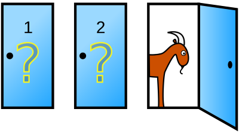

# Monty Hall Problem

## Overview

### Problem

The Monty Hall problem is a brain teaser, in the form of a probability puzzle, loosely based on the American television game show "Let's Make a Deal" and named after its original host, Monty Hall.

The problem can be described in the following way:

> Suppose you're on a game show, and you're given the choice of three  doors:
>
> - behind one door is a car;
> - behind the others there are goats.
>
> You pick a  door, say No. 1, and the host, who knows what's behind the doors, opens  another door, say No. 3, which always has a goat. He then says to you, "Do you  want to switch to door No. 2?"



### Question

Is it to your advantage to switch the doors or to remain with your initial one? Or maybe there is not important?

### Answer

The answer is to always switch. It will give you better chances (2/3) to win as opposed to not switching, when you remain with the 1/3 chances to win. This is explained and demonstrated in this Wikipedia article:

- https://en.wikipedia.org/wiki/Monty_Hall_problem

## What I did

To demonstrate the probabilities, I created a `MontyHallGame` class that plays the game:

```csharp
internal class MontyHallGame
{
	public MontyHallGame()
	{
		...
	}

	public void PickDoor(int doorNumber)
	{
        ...
	}

	public void SwitchDoor(bool doSwitch)
	{
		...
	}

	public bool DidPlayerWin()
	{
		...
	}
}

```

To play the game we do the following steps:

- Generate a game. Each time it is created, the `MontyHallGame` class generates a random setup. So, we do not know where the car is.
- Then, we pick a door by calling the `PickDoor` method. I randomly choose a door number in the tests. The game will immediately open a door with a goat.
- In the end we decide if we want to switch to the other door or not, by calling `SwitchDoor`.

### Test

I played two sets of 10.000.000 games:

- One set when the player always switches the doors;
- One set when the player always keeps the initial choice.

### Results

| Game Strategy | Winning Games Count                         |
| ------------- | ------------------------------------------- |
| always keep   | 3.331.267 from 10.000.000 (proximately 1/3) |
| always switch | 6.666.168 from 10.000.000 (proximately 2/3) |

